# 图库项目
## 所需依赖
- MySQL
- redis
- minio
- websocket
- react
- springboot2.xx

## 运行
1. 启动minio
2. 启动redis
3. 启动MySQL
4. 修改配置文件/ 配置环境
5. 运行sql文件 `doc/create_table.sql`
6. 启动前端 
7. 启动后端

## 模块
### 后台管理
后台管理：
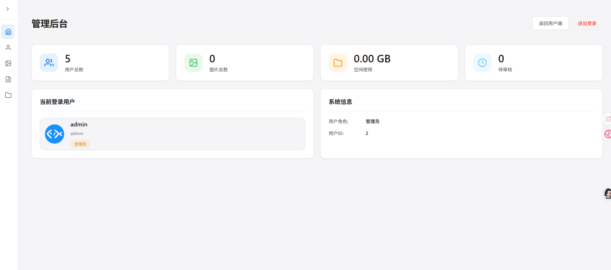
用户管理
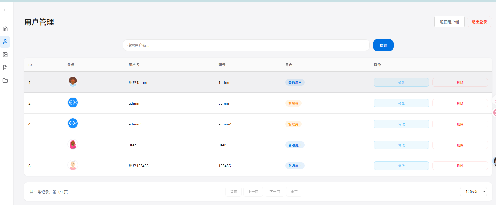

图片管理
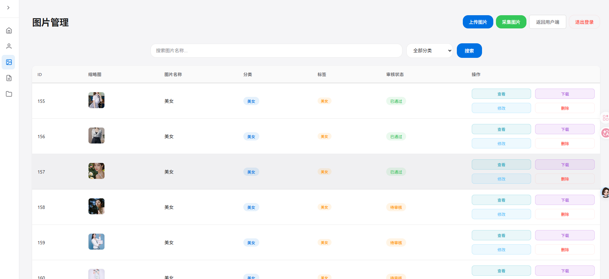
 - minio、caffeine、redis 二级缓存
 - 爬虫采集图片

图片审核
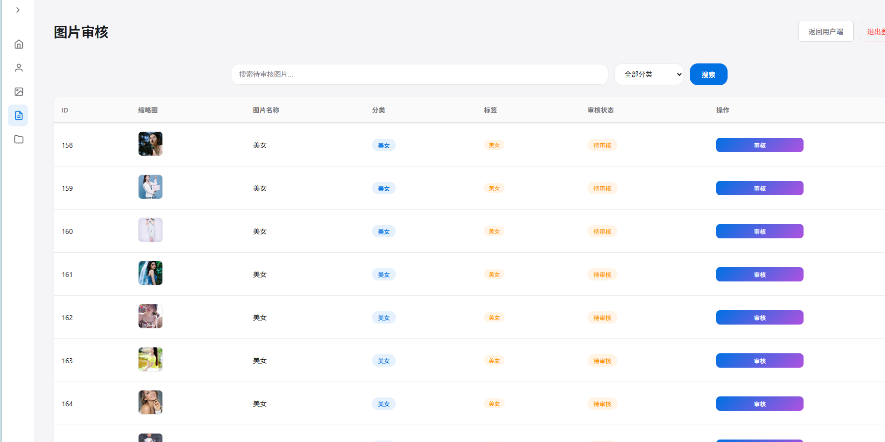
空间管理
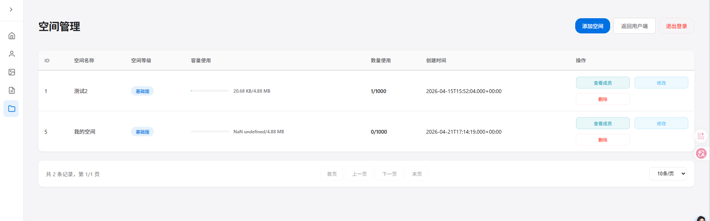

### 用户前台
用户首页
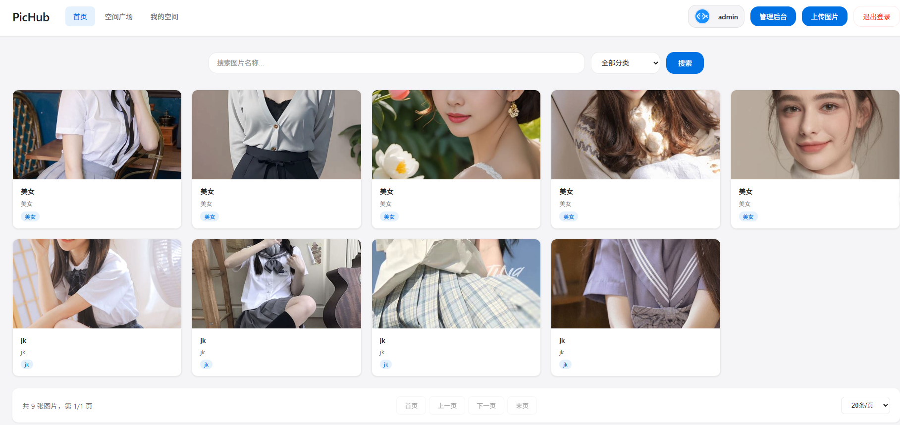

空间广场
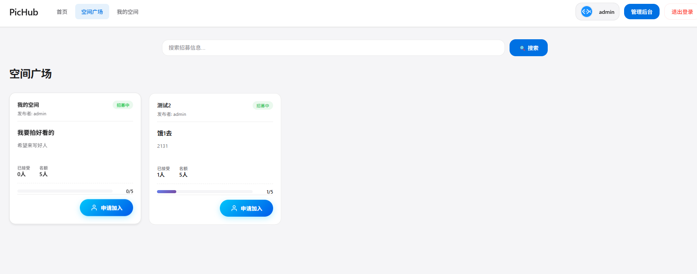

我的空间
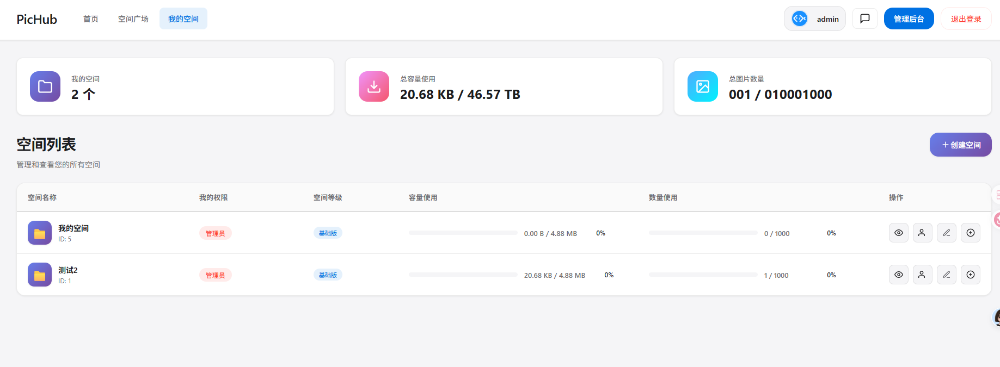
- 创建空间
    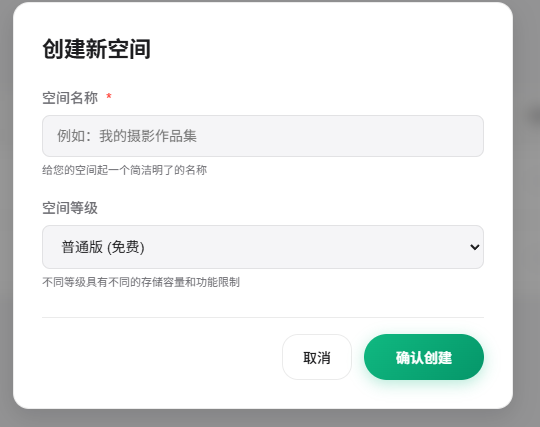
- 审核
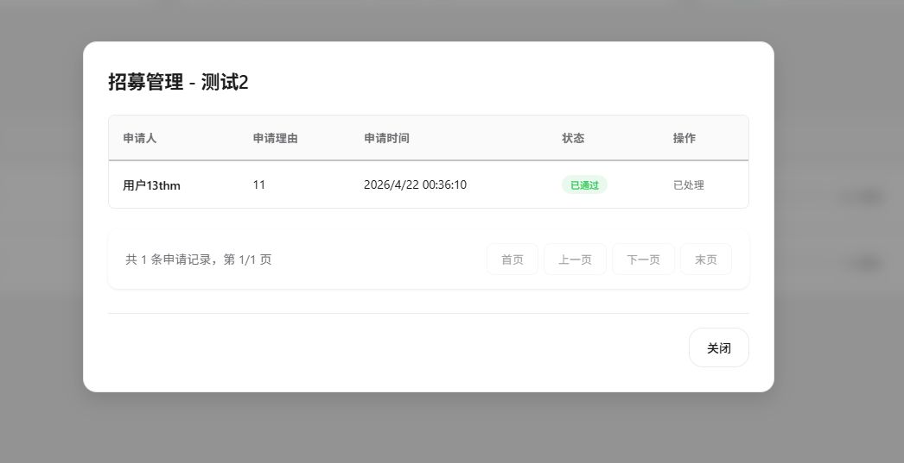
- 编辑空间
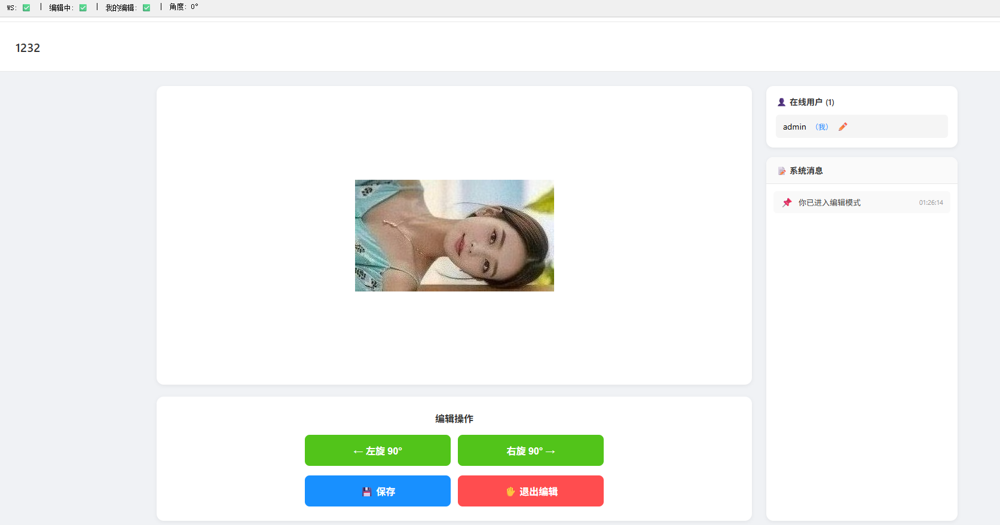
- 空间照片
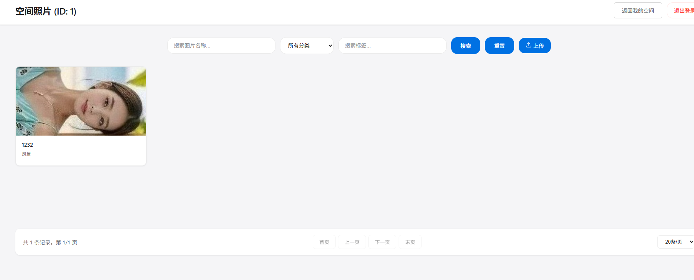